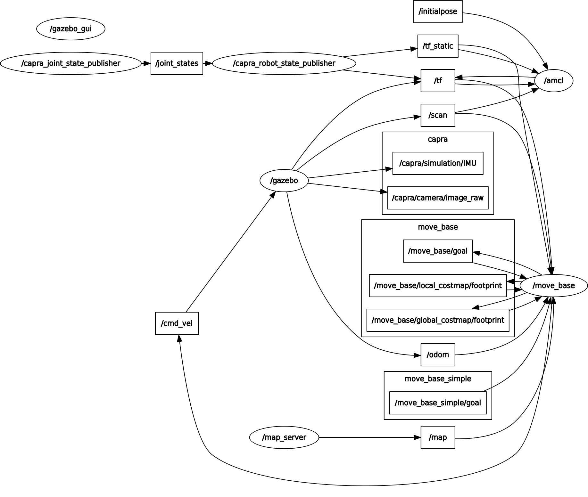
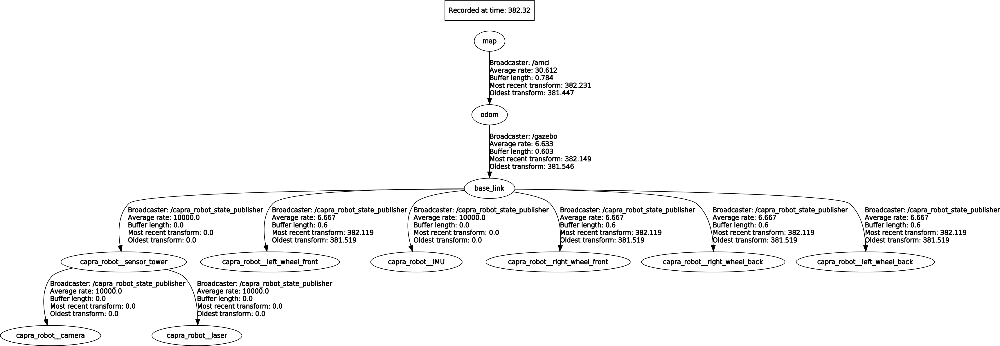
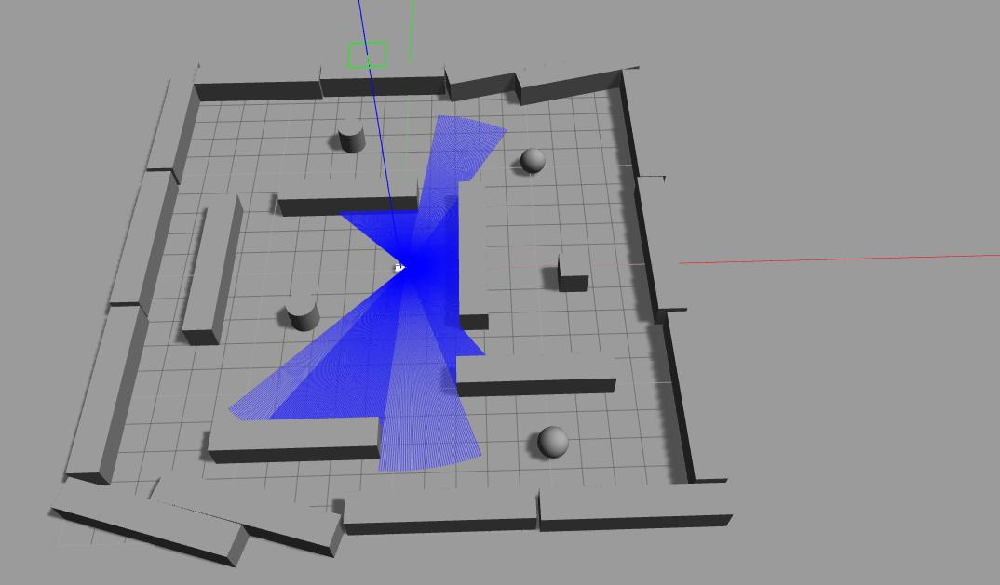

# capra_simulation

Capra-Takin's **capra_simulation** package uses Gazebo, a robot simulator, to launch Capra's custom worlds and spawn Capra's robot

### Dependencies

See [capra_simulation dependencies](doc/dependencies.md)

### Overview

For an overview of how to extend this package, see [capra_simulation overview](doc/overview.md)

### Usage

1. Place this package in your "src" folder, build your workspace with "catkin_make", and run "roscore". 

2. Launch the custom world. By default, the launch files will open the Gazebo GUI.

```sh
$ roslaunch capra_simulation world.launch
```

3. Spawn the capra robot. Modify the -x -y -z parameters to spawn in a specific location.

```sh
$ rosrun capra_simulation spawn_model -file `rospack find capra_simulation`/models/urdf/capra_robot.urdf -urdf -x 0 -y 0 -z 0 -model takin
```

spawn_model is a python script that let's you keep your robot's location relative to the ROS package path. This method enhances portability as opposed to adding the robot directly in the launch file and in the Gazebo model database. See [using roslaunch to spawn URDF robots](http://gazebosim.org/tutorials?tut=ros_roslaunch#UsingroslaunchtoSpawnURDFRobots)   


### Published/Subscribed Topics




### tf




### Gazebo


